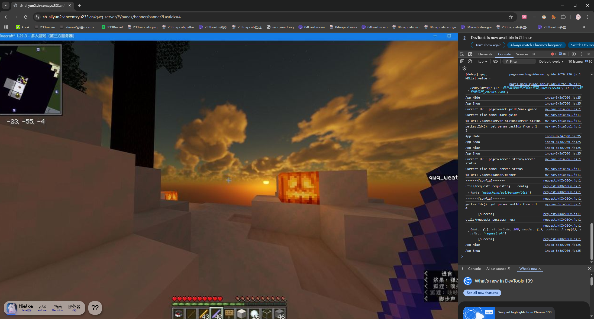
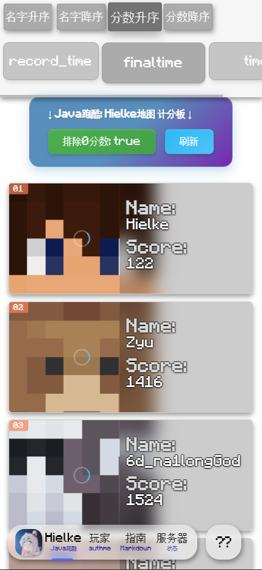
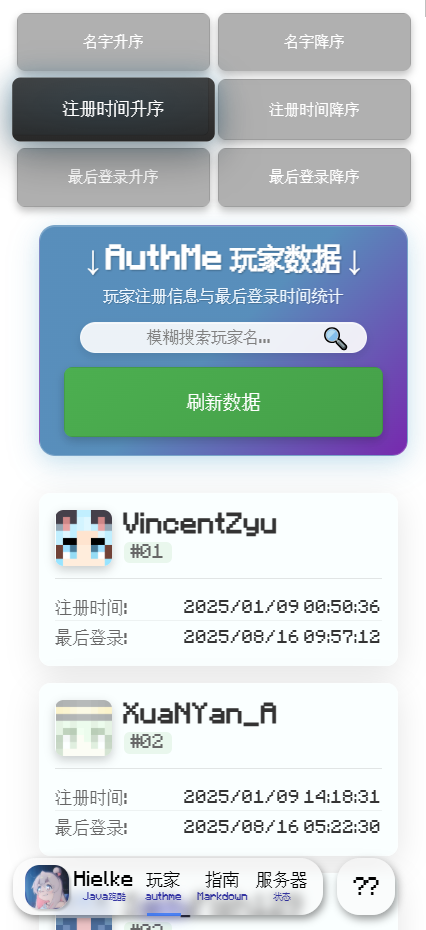
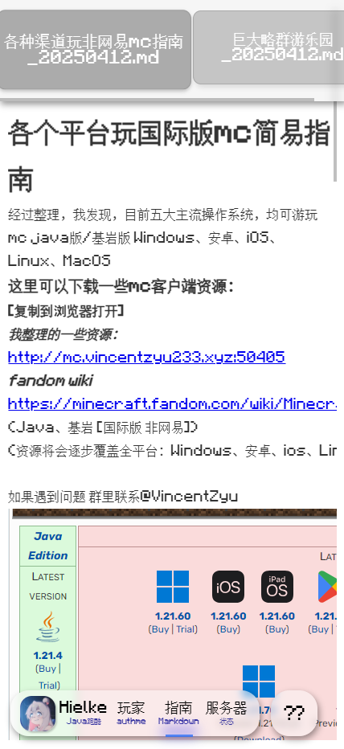
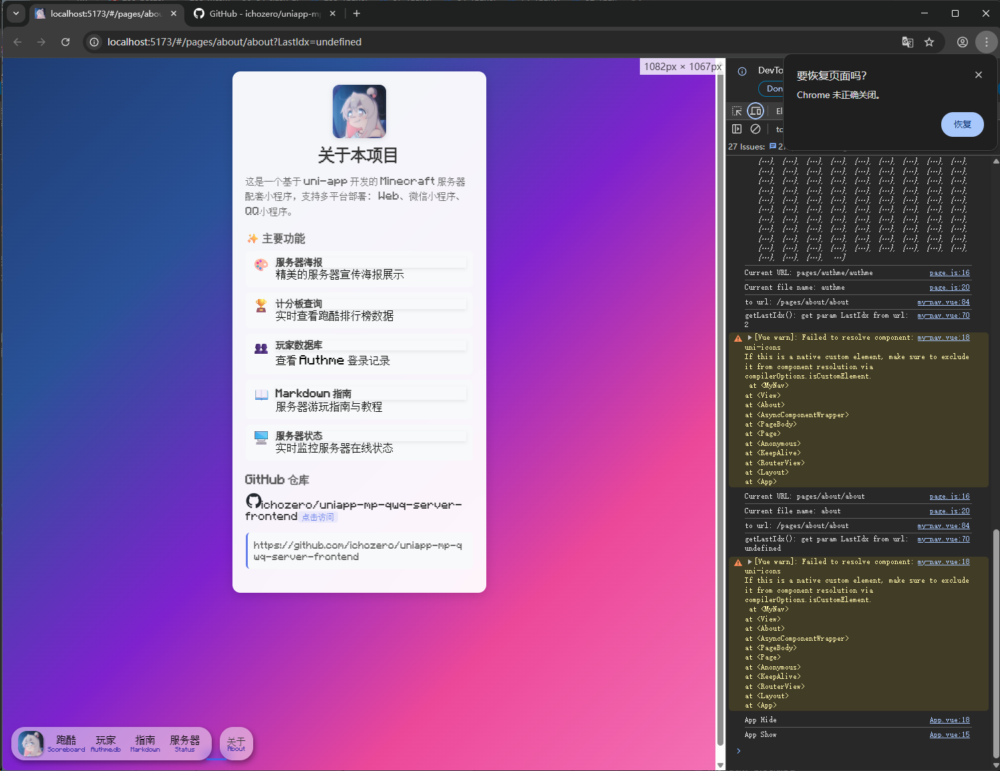

[English README](./readme_en.md)

# 服务器配套小程序（uniapp-mp-qwq-server-frontend）

面向 Minecraft 服务器的配套小程序前端。用于展示服务器相关的榜单、玩家与文档信息，便于玩家快速了解与参与服务器活动。

## 页面一览

0. Banner 海报（服务器截图轮播）
   - 展示服务器截图与公告。
   
   

1. Index 跑酷计分板
   - 展示跑酷榜单，支持按不同维度排序与刷新。

   

2. AuthMe 历史注册玩家列表
   - 支持按玩家名模糊搜索，显示注册时间与最后登录时间。

   

3. Markdown 进服指导文档
   - 使用 Markdown 编写的简易入服指南与资源链接。

   

4. About关于
   - 展示本网站的一些信息捏
   

## 简介

本项目为“服务器配套小程序”前端部分，采用 UniApp 技术栈开发，适用于小程序/H5 等多端构建与部署。根据服务器实际需求，可对页面与接口进行裁剪或扩展。

