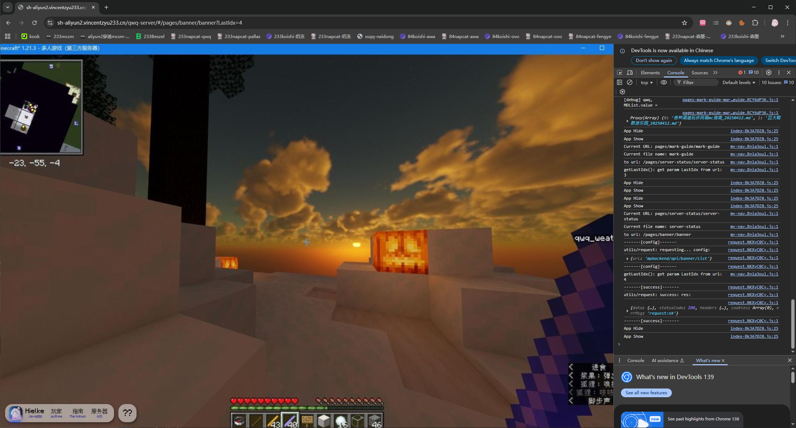
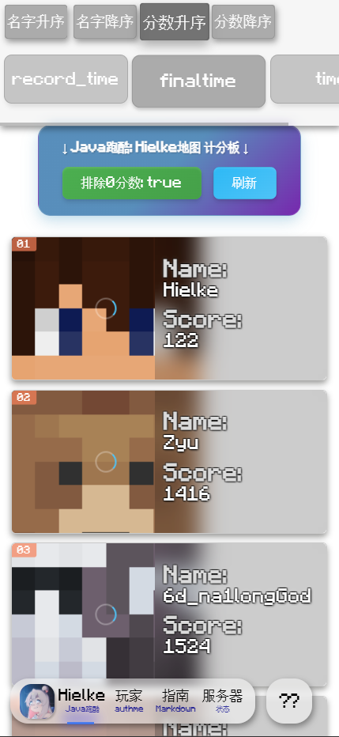
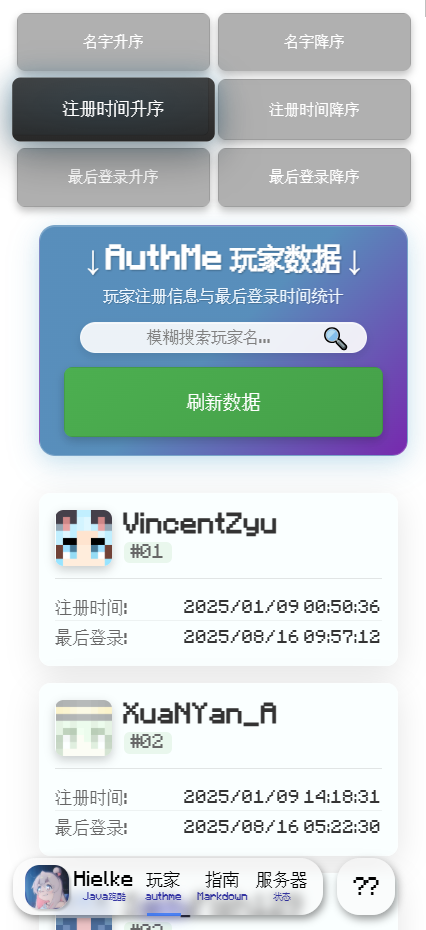
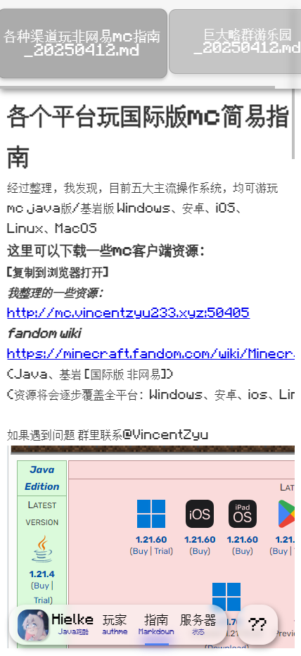

[中文版 README](./readme.md)

# Server Companion Mini-App (uniapp-mp-qwq-server-frontend)

A UniApp-based frontend for a Minecraft server companion mini-program. It shows leaderboards, player info, docs, and server status so players can get started quickly.

## Pages

0. Banner Screenshots
   - Rotating server screenshots and announcements.

   

1. Index: Parkour Leaderboard
   - Shows parkour rankings with multiple sort modes and refresh.

   

2. AuthMe: Historical Registered Players
   - Fuzzy search by name; shows register time and last login time.

   

3. Markdown: Getting Started Guide
   - A Markdown-based onboarding guide and useful links.

   

4. Server Status
   - Query and display basic online status info.

   WIP placeholder:

   

## Overview

This project is the frontend of a "server companion mini-app" built with UniApp, targeting multi-platform builds like Mini Programs and H5. Customize pages and APIs as needed for your server.

